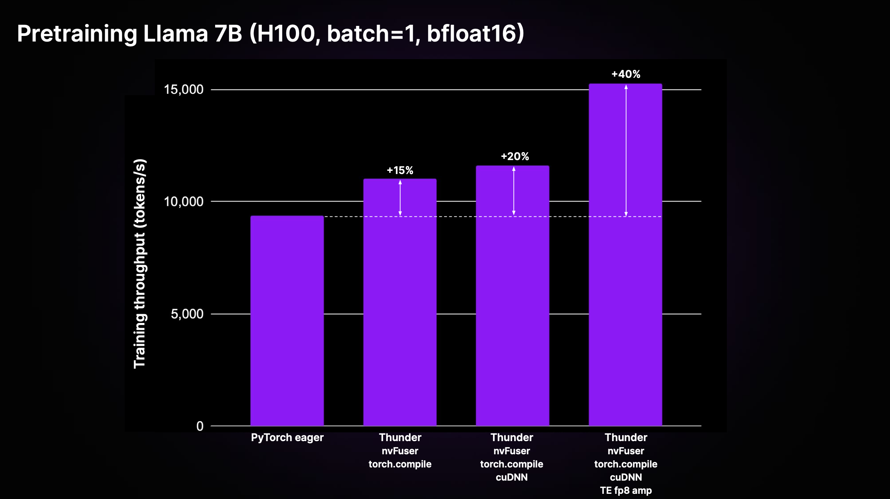
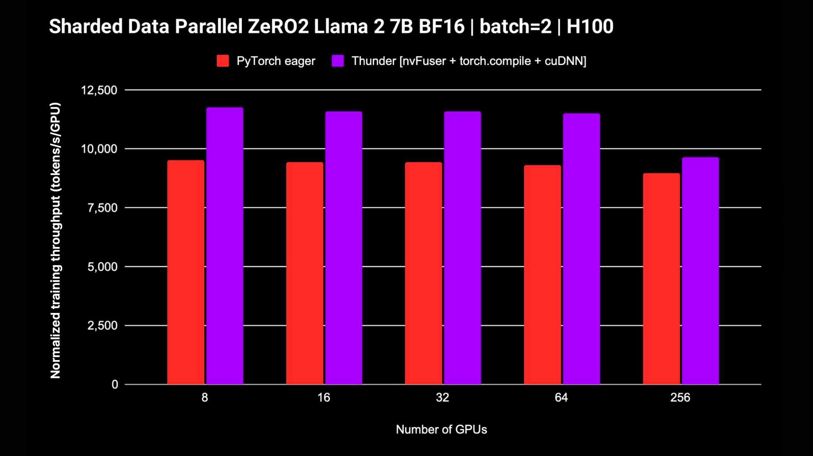

<div align="center">


    <br/>
<br/>

**Make PyTorch models Lightning fast.**

______________________________________________________________________

<p align="center">
  <a href="https://lightning.ai/">Lightning.ai</a> •
  <a href="#performance">Performance</a> •
  <a href="#get-started">Get started</a> •
  <a href="#install-thunder">Install</a> •
  <a href="#hello-world">Examples</a> •
  <a href="#inside-thunder-a-brief-look-at-the-core-features">Inside Thunder</a> •
  <a href="#get-involved">Get involved!</a> •
  <a href="#documentation">Documentation</a>
</p>

[](https://github.com/Lightning-AI/lightning-thunder/blob/main/LICENSE)
[](https://github.com/Lightning-AI/lightning-thunder/actions/workflows/ci-testing.yml)
[](https://github.com/Lightning-AI/lightning-thunder/actions/workflows/ci-checks.yml)
[](https://lightning-thunder.readthedocs.io/en/latest/?badge=latest)
[](https://results.pre-commit.ci/latest/github/Lightning-AI/lightning-thunder/main)

</div>

# Welcome to ⚡ Lightning Thunder

**Thunder makes PyTorch models Lightning fast.**

Thunder is a source-to-source compiler for PyTorch. It makes PyTorch programs faster by combining and using different hardware executors at once (for instance, [nvFuser](https://github.com/NVIDIA/Fuser), [torch.compile](https://pytorch.org/docs/stable/torch.compiler.html), [cuDNN](https://developer.nvidia.com/cudnn), and [TransformerEngine FP8](https://github.com/NVIDIA/TransformerEngine)).

It supports both single and multi-GPU configurations.
Thunder aims to be usable, understandable, and extensible.

&#160;

> \[!Note\]
> Lightning Thunder is in alpha. Feel free to get involved, but expect a few bumps along the way.

&#160;

## Single-GPU performance

Thunder can achieve significant speedups over standard non-compiled PyTorch code ("PyTorch eager"), through the compounding effects of optimizations and the use of best-in-class executors. The figure below shows the pretraining throughput for Llama 2 7B as implemented in [LitGPT](https://github.com/Lightning-AI/litgpt).

<div align="center">

</div>

As shown in the plot above, Thunder achieves a 40% speedup in training throughput compared to eager code on H100 using a combination of executors including nvFuser, torch.compile, cuDNN, and TransformerEngine FP8.

&#160;

## Multi-GPU performance

Thunder also supports distributed strategies such as DDP and FSDP for training models on multiple GPUs. The following plot displays the normalized throughput measured for Llama 2 7B without FP8 mixed precision; support for FSDP is in progress.

<div align="center">

</div>

&#160;

## Get started

The easiest way to get started with Thunder, requiring no extra installations or setups, is by using our [Zero to Thunder Tutorial Studio](https://lightning.ai/lightning-ai/studios/zero-to-thunder-tutorial).

&#160;

## Install Thunder

To use Thunder on your local machine, first install [nvFuser](https://github.com/NVIDIA/Fuser) nightly and PyTorch nightly together as follows:

```bash
# install nvFuser which installs the matching nightly PyTorch
pip install --pre 'nvfuser-cu121[torch]' --extra-index-url https://pypi.nvidia.com
```

Then, install Thunder as follows:

```
# install thunder
pip install lightning-thunder
```

<details>
  <summary>Advanced install options</summary>
    <!-- following section will be skipped from PyPI description -->

&#160;

### Install from main

Alternatively, you can install the latest version of Thunder directly from this GitHub repository as follows:

```
# 1) Install nvFuser and PyTorch nightly dependencies:
pip install --pre 'nvfuser-cu121[torch]' --extra-index-url https://pypi.nvidia.com
```

```bash
# 2) Install Thunder itself
pip install git+https://github.com/Lightning-AI/lightning-thunder.git
```

&#160;

### Install to tinker and contribute

If you are interested in tinkering with and contributing to Thunder, we recommend cloning the Thunder repository and installing it in pip's editable mode:

```bash
git clone https://github.com/Lightning-AI/lightning-thunder.git
cd lightning-thunder
pip install -e .
```

&#160;

### Develop and run tests

After cloning the lightning-thunder repository and installing it as an editable package as explained above, ou can set up your environment for developing Thunder by installing the development requirements:

```bash
pip install -r requirements/devel.txt
```

Now you run tests:

```bash
pytest thunder/tests
```

Thunder is very thoroughly tested, so expect this to take a while.

</details>
<!-- end skipping PyPI description -->

&#160;

## Hello World

Below is a simple example of how Thunder allows you to compile and run PyTorch code:

```python
import torch
import thunder


def foo(a, b):
    return a + b


jfoo = thunder.jit(foo)

a = torch.full((2, 2), 1)
b = torch.full((2, 2), 3)

result = jfoo(a, b)

print(result)

# prints
# tensor(
#  [[4, 4]
#   [4, 4]])
```

The compiled function `jfoo` takes and returns PyTorch tensors, just like the original function, so modules and functions compiled by Thunder can be used as part of larger PyTorch programs.

&#160;

## Train models

Thunder is in its early stages and should not be used for production runs yet.

However, it can already deliver outstanding performance for pretraining and finetuning LLMs supported by [LitGPT](https://github.com/Lightning-AI/lit-gpt), such as Mistral, Llama 2, Gemma, Falcon, and others.

Check out [the LitGPT integration](https://github.com/Lightning-AI/litgpt/tree/main/extensions/thunder) to learn about running LitGPT and Thunder together.

&#160;

## Inside Thunder: A brief look at the core features

Given a Python callable or PyTorch module, Thunder can generate an optimized program that:

- Computes its forward and backward passes
- Coalesces operations into efficient fusion regions
- Dispatches computations to optimized kernels
- Distributes computations optimally across machines

To do so, Thunder ships with:

- A JIT for acquiring Python programs targeting PyTorch and custom operations
- A multi-level intermediate representation (IR) to represent operations as a trace of a reduced operation set
- An extensible set of transformations on the trace of a computational graph, such as `grad`, fusions, distributed (like `ddp`, `fsdp`), functional (like `vmap`, `vjp`, `jvp`)
- A way to dispatch operations to an extensible collection of executors

Thunder is written entirely in Python. Even its trace is represented as valid Python at all stages of transformation. This allows unprecedented levels of introspection and extensibility.

Thunder doesn't generate code for accelerators, such as GPUs, directly. It acquires and transforms user programs so that it's possible to optimally select or generate device code using fast executors like:

- [torch.compile](https://pytorch.org/get-started/pytorch-2.0/)
- [nvFuser](https://github.com/NVIDIA/Fuser)
- [cuDNN](https://developer.nvidia.com/cudnn)
- [Apex](https://github.com/NVIDIA/apex)
- [TransformerEngine](https://github.com/NVIDIA/TransformerEngine)
- [PyTorch eager](https://github.com/pytorch/pytorch)
- Custom CUDA kernels through [PyCUDA](https://documen.tician.de/pycuda/tutorial.html#interoperability-with-other-libraries-using-the-cuda-array-interface), [Numba](https://numba.readthedocs.io/en/stable/cuda/kernels.html), [CuPy](https://docs.cupy.dev/en/stable/user_guide/kernel.html)
- Custom kernels written in [OpenAI Triton](https://github.com/openai/triton)

Modules and functions compiled with Thunder fully interoperate with vanilla PyTorch and support PyTorch's autograd. Also, Thunder works alongside torch.compile to leverage its state-of-the-art optimizations.

&#160;

## Documentation

Docs are currently not hosted publicly. However you can build them locally really quickly:

```bash
make docs
```

and point your browser to the generated docs at `docs/build/index.html`.

&#160;

## Get involved!

We appreciate your feedback and contributions. If you have feature requests, questions, or want to contribute code or config files, please don't hesitate to use the [GitHub Issue](https://github.com/Lightning-AI/lightning-thunder/issues) tracker.

We welcome all individual contributors, regardless of their level of experience or hardware. Your contributions are valuable, and we are excited to see what you can accomplish in this collaborative and supportive environment.

&#160;

## License

Lightning Thunder is released under the [Apache 2.0](https://www.apache.org/licenses/LICENSE-2.0) license.
See the [LICENSE](LICENSE) file for details.
