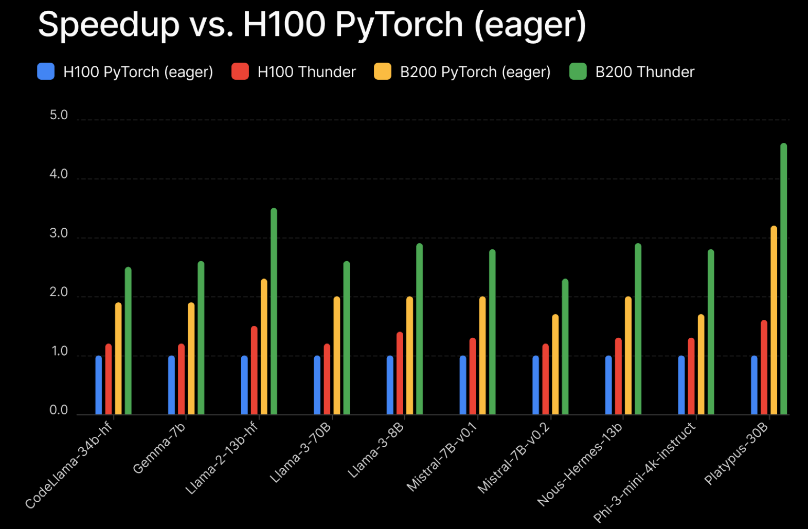
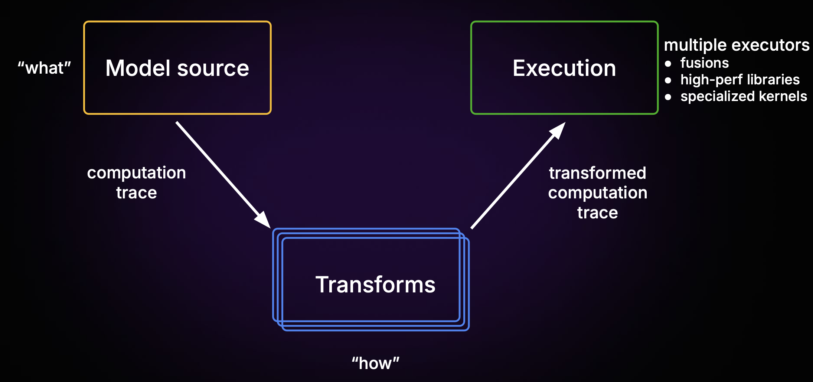

<div align='center'>

# Give your PyTorch models superpowers ⚡

</div>

<div align="center">


<br/>
<br/>

&#160;

<strong>Source-to-source compiler for PyTorch.</strong>
Understandable. Inspectable. Extensible.

</div>

<div align='center'>

<pre>
✅ Run PyTorch 40% faster   ✅ Quantization                ✅ Kernel fusion        
✅ Training recipes         ✅ FP4/FP6/FP8 precision       ✅ Distributed TP/PP/DP 
✅ Inference recipes        ✅ Ready for NVIDIA Blackwell  ✅ CUDA Graphs          
✅ LLMs, non LLMs and more  ✅ Custom Triton kernels       ✅ Compose all the above
</pre>

</div>

Thunder is a source-to-source deep learning compiler for PyTorch that focuses on making it simple to optimize models for training and inference.

It provides:

- a simple, Pythonic IR capturing the entire computation
- a rich system of transforms that simultaneously operate on the computation IR, the model, and the weights
- an extensible dispatch mechanism to fusers and optimized kernel libraries

With Thunder you can:

- profile deep learning programs easily, map individual ops to kernels and inspect programs interactively
- programmatically replace sequences of operations with optimized ones and see the effect on performance
- acquire full computation graphs without graph breaks by flexibly extending the interpreter
- modify programs to fully utilize bleeding edge kernel libraries on specific hardware
- write models for single GPU and transform them to run distributed
- quickly iterate on mixed precision and quantization strategies to search for combinations that minimally affect quality
- bundle all optimizations in composable recipes, so they can be ported across model families

Ultimately, you should think about Thunder as a highly efficient tool to go from “unoptimized” to “optimized”.

If that is of interest for you, read on to Install Thunder and get started quickly.

<div align='center'>

[](https://github.com/Lightning-AI/lightning-thunder/blob/main/LICENSE)
[](https://github.com/Lightning-AI/lightning-thunder/actions/workflows/ci-testing.yml)
[](https://github.com/Lightning-AI/lightning-thunder/actions/workflows/ci-checks.yml)
[](https://lightning-thunder.readthedocs.io/en/latest/?badge=latest)
[](https://results.pre-commit.ci/latest/github/Lightning-AI/lightning-thunder/main)

</div>

<div align="center">
  <div style="text-align: center;">
    <a target="_blank" href="#quick-start" style="margin: 0 10px;">Quick start</a> •
    <a target="_blank" href="#examples" style="margin: 0 10px;">Examples</a> •
    <a target="_blank" href="#performance" style="margin: 0 10px;">Performance</a> •
    <!-- <a target="_blank" href="#hosting-options" style="margin: 0 10px;">Hosting</a> • -->
    <a target="_blank" href="https://lightning.ai/docs/thunder/latest/" style="margin: 0 10px;">Docs</a>
  </div>
</div>

&#160;

<!--
<div align="center">
<a target="_blank" href="https://lightning.ai/docs/thunder/home/get-started">
  
</a>
</div>
-->

&#160;

<div align="center">

</div>

# Quick start

Install Thunder via pip ([more options](https://lightning.ai/docs/thunder/latest/fundamentals/installation.html)):

```bash
pip install lightning-thunder

pip install -U torch torchvision
pip install nvfuser-cu128-torch28 nvidia-cudnn-frontend  # if NVIDIA GPU is present
```

<details>
  <summary>For older versions of <code>torch</code></summary>

<code>torch==2.7</code> + CUDA 12.8

```bash
pip install lightning-thunder

pip install torch==2.7.0 torchvision==0.22
pip install nvfuser-cu128-torch27 nvidia-cudnn-frontend  # if NVIDIA GPU is present
```

<code>torch==2.6</code> + CUDA 12.6

```bash
pip install lightning-thunder

pip install torch==2.6.0 torchvision==0.21
pip install nvfuser-cu126-torch26 nvidia-cudnn-frontend  # if NVIDIA GPU is present
```

<code>torch==2.5</code> + CUDA 12.4

```bash
pip install lightning-thunder

pip install torch==2.5.0 torchvision==0.20
pip install nvfuser-cu124-torch25 nvidia-cudnn-frontend  # if NVIDIA GPU is present
```

</details>

<details>
  <summary>Advanced install options</summary>

### Install optional executors

```bash
# Float8 support (this will compile from source, be patient)
pip install "transformer_engine[pytorch]"
```

### Install Thunder bleeding edge

```bash
pip install git+https://github.com/Lightning-AI/lightning-thunder.git@main
```

### Install Thunder for development

```bash
git clone https://github.com/Lightning-AI/lightning-thunder.git
cd lightning-thunder
pip install -e .
```

</details>

### Hello world

Define a function or a torch module:

```python
import torch.nn as nn

model = nn.Sequential(nn.Linear(2048, 4096), nn.ReLU(), nn.Linear(4096, 64))
```

Optimize it with Thunder:

```python
import thunder
import torch

thunder_model = thunder.compile(model)

x = torch.randn(64, 2048)

y = thunder_model(x)

torch.testing.assert_close(y, model(x))
```

## Examples

### LLM training

Install LitGPT (without updating other dependencies)

```
pip install --no-deps 'litgpt[all]'
```

and run

```python
import thunder
import torch
import litgpt

with torch.device("cuda"):
    model = litgpt.GPT.from_name("Llama-3.2-1B").to(torch.bfloat16)

thunder_model = thunder.compile(model)

inp = torch.ones((1, 2048), device="cuda", dtype=torch.int64)

out = thunder_model(inp)
out.sum().backward()
```

### HuggingFace BERT inference

Install Hugging Face Transformers (recommended version is `4.50.2` and above)

```
pip install -U transformers
```

and run

```python
import thunder
import torch
import transformers

model_name = "bert-large-uncased"

tokenizer = transformers.AutoTokenizer.from_pretrained(model_name)

with torch.device("cuda"):
    model = transformers.AutoModelForCausalLM.from_pretrained(
        model_name, torch_dtype=torch.bfloat16
    )
    model.requires_grad_(False)
    model.eval()

    inp = tokenizer(["Hello world!"], return_tensors="pt")

thunder_model = thunder.compile(model)

out = thunder_model(**inp)
print(out)
```

### HuggingFace DeepSeek R1 distill inference

Install Hugging Face Transformers (recommended version is `4.50.2` and above)

```
pip install -U transformers
```

and run

```python
import torch
import transformers
import thunder

model_name = "deepseek-ai/DeepSeek-R1-Distill-Llama-8B"

tokenizer = transformers.AutoTokenizer.from_pretrained(model_name)

with torch.device("cuda"):
    model = transformers.AutoModelForCausalLM.from_pretrained(
        model_name, torch_dtype=torch.bfloat16
    )
    model.requires_grad_(False)
    model.eval()

    inp = tokenizer(["Hello world! Here's a long story"], return_tensors="pt")

thunder_model = thunder.compile(model)

out = thunder_model.generate(
    **inp, do_sample=False, cache_implementation="static", max_new_tokens=100
)
print(out)
```

### Vision Transformer inference

```python
import thunder
import torch
import torchvision as tv

with torch.device("cuda"):
    model = tv.models.vit_b_16()
    model.requires_grad_(False)
    model.eval()

    inp = torch.randn(128, 3, 224, 224)

out = model(inp)

thunder_model = thunder.compile(model)

out = thunder_model(inp)
```

### Benchmarks

Although is Thunder a tool for optimizing models, rather than an opaque compiler that gets you speedups out of the box, here is a set of benchmarks.

Perf-wise, out of the box Thunder is in the ballpark of torch compile, especially when using CUDAGraphs. Note however that Thunder is not a competitor to torch compile! It can actually use torch compile as one of its fusion executors.

The script `examples/quickstart/hf_llm.py` demonstrates how to benchmark a model for text generation, forward pass, forward pass with loss, and a full forward + backward computation.

On an H100 with torch=2.8.0 and nvfuser-cu128-torch28 and Transformers 4.55.4 running Llama 3.2 1B we see the following timings:

```
Transformers with torch.compile and CUDAGraphs (reduce-overhead mode):  521ms
Transformers with torch.compile but no CUDAGraphs (default mode):       814ms
Transformers without torch.compile:                                    1493ms
Thunder with CUDAGraphs:                                                542ms
```

## Plugins

Plugins are a way to apply optimizations to a model, such as parallelism and quantization.

Thunder comes with a few plugins included of the box, but it's easy to write new ones.

- scale up with distributed strategies with DDP, FSDP, TP ()
- optimize numerical precision with FP8, MXFP8
- save memory with quantization
- reduce latency with CUDAGraphs
- debugging and profiling

For example, in order to reduce CPU overheads via CUDAGraphs you can add "reduce-overhead"
to the `plugins=` argument of `thunder.compile`:

```python
thunder_model = thunder.compile(model, plugins="reduce-overhead")
```

This may or may not make a big difference. The point of Thunder is that you can easily
swap optimizations in and out and explore the best combination for your setup.

## How it works

Thunder works in three stages:

1. ⚡️ It acquires your model by interpreting Python bytecode and producing a straight-line Python program

1. ️⚡️ It transforms the model and computation trace to make it distributed, change precision

1. ⚡️ It routes parts of the trace for execution

   - fusion (`NVFuser`, `torch.compile`)
   - specialized libraries (e.g. `cuDNN SDPA`, `TransformerEngine`)
   - custom Triton and CUDA kernels
   - PyTorch eager operations

&#160;

<div align="center">

</div>

&#160;

This is how the trace looks like for a simple MLP:

```python
import thunder
import torch
import torch.nn as nn

model = nn.Sequential(nn.Linear(1024, 2048), nn.ReLU(), nn.Linear(2048, 256))

thunder_model = thunder.compile(model)
y = thunder_model(torch.randn(4, 1024))

print(thunder.last_traces(thunder_model)[-1])
```

This is the acquired trace, ready to be transformed and executed:

```python
def computation(input, t_0_bias, t_0_weight, t_2_bias, t_2_weight):
# input: "cuda:0 f32[4, 1024]"
# t_0_bias: "cuda:0 f32[2048]"
# t_0_weight: "cuda:0 f32[2048, 1024]"
# t_2_bias: "cuda:0 f32[256]"
# t_2_weight: "cuda:0 f32[256, 2048]"
t3 = ltorch.linear(input, t_0_weight, t_0_bias) # t3: "cuda:0 f32[4, 2048]"
t6 = ltorch.relu(t3, False) # t6: "cuda:0 f32[4, 2048]"
t10 = ltorch.linear(t6, t_2_weight, t_2_bias) # t10: "cuda:0 f32[4, 256]"
return (t10,)
```

Note how Thunder's intermediate representation is just (a subset of) Python!

## Performance

Thunder is fast. Here are the speed-ups obtained on a pre-training task using LitGPT on H100 and B200 hardware, relative to PyTorch eager.

<div align="center">

</div>

# Community

Thunder is an open source project, developed in collaboration with the community with significant contributions from NVIDIA.

💬 [Get help on Discord](https://discord.com/invite/XncpTy7DSt)
📋 [License: Apache 2.0](https://github.com/Lightning-AI/litserve/blob/main/LICENSE)
